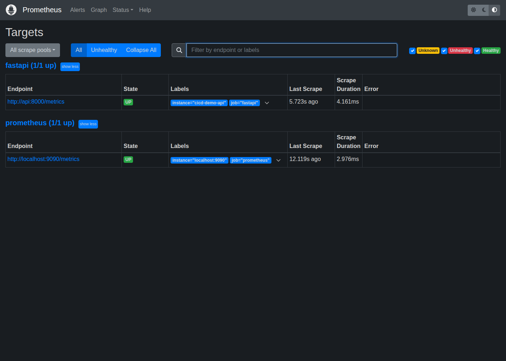
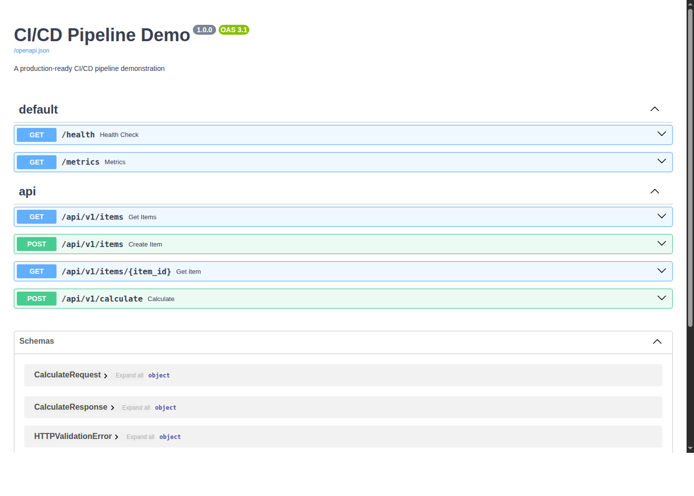

# CI/CD Pipeline Demo

A production-ready CI/CD pipeline demonstration showcasing modern DevOps practices. This project includes containerization, orchestration, monitoring, security scanning, and infrastructure as code.


## DevOps Capabilities

### Observability Stack

Real-time monitoring with Prometheus metrics collection and Grafana dashboards.


**Features:**
- Request rate, latency (P95), and error rate monitoring
- Requests by endpoint, status code, and HTTP method
- Auto-refreshing dashboards with 5-second intervals

### Prometheus Metrics

Application metrics automatically scraped and stored for analysis.



**Metrics collected:**
- `http_requests_total` - Request counts by endpoint/status
- `http_request_duration_seconds` - Response time histograms
- `http_request_size_bytes` / `http_response_size_bytes` - Payload sizes

### API Documentation

Interactive Swagger UI for API exploration and testing.



## Features

- **FastAPI REST API** with health checks, CRUD operations, and calculator endpoints
- **Observability** with Prometheus metrics and Grafana dashboards
- **Container Orchestration** with Kubernetes manifests and Helm charts
- **Infrastructure as Code** with Terraform (Render deployment)
- **Multi-stage Docker builds** for optimized production images
- **GitHub Actions CI/CD** with lint, test, build, security scan, and deploy
- **Security scanning** with Trivy (containers) and CodeQL (SAST)
- **Dependency scanning** with pip-audit
- **Pre-commit hooks** for shift-left quality gates
- **Load testing** with k6 scripts
- **Automated releases** with semantic versioning

## Pipeline Overview

```
+-------------+     +-------------+     +-------------+     +-------------+
|    Lint     | --> |    Test     | --> |    Build    | --> |   Deploy    |
| black/ruff  |     | pytest/cov  |     | Docker push |     |   staging   |
+-------------+     +-------------+     +-------------+     +-------------+
                          |
                          v
                    +-----------+
                    | Coverage  |
                    |  Report   |
                    +-----------+
```

## Quick Start

### Using Docker (Recommended)

```bash
# Clone the repository
git clone https://github.com/masteroflink/cicd-pipeline-demo.git
cd cicd-pipeline-demo

# Build and run
docker compose up --build

# Access the API
curl http://localhost:8000/health
```

### Using Make

```bash
# Build the development image
make build

# Start the server
make up

# Run tests
make test

# Run tests with coverage
make test-cov

# Run linting
make lint
```

### Using the Published Image

```bash
# Pull the latest image
docker pull ghcr.io/masteroflink/cicd-pipeline-demo:latest

# Run the container
docker run -p 8000:8000 ghcr.io/masteroflink/cicd-pipeline-demo:latest

# Access the API
curl http://localhost:8000/health
```

## API Endpoints

| Method | Endpoint | Description |
|--------|----------|-------------|
| GET | `/health` | Health check with status, version, timestamp |
| GET | `/metrics` | Prometheus metrics endpoint |
| GET | `/api/v1/items` | List all items |
| POST | `/api/v1/items` | Create a new item |
| GET | `/api/v1/items/{id}` | Get item by ID |
| POST | `/api/v1/calculate` | Perform calculation (add, subtract, multiply, divide) |

### Example Requests

```bash
# Health check
curl http://localhost:8000/health

# Create an item
curl -X POST http://localhost:8000/api/v1/items \
  -H "Content-Type: application/json" \
  -d '{"name": "Example", "description": "An example item"}'

# Calculate
curl -X POST http://localhost:8000/api/v1/calculate \
  -H "Content-Type: application/json" \
  -d '{"a": 10, "b": 5, "operation": "add"}'
```

## Development

### Prerequisites

- Docker and Docker Compose
- Python 3.11+ (for local development without Docker)
- Make (optional, for convenience commands)

### Running Tests

```bash
# Run all tests
make test

# Run with coverage report
make test-cov

# Run specific test file
docker compose run --rm api pytest tests/test_calculator.py -v
```

### Linting

```bash
# Check all linting
make lint

# Auto-format code
make format
```

### Pre-commit Hooks

```bash
# Install pre-commit
pip install pre-commit

# Set up hooks (runs automatically on git commit)
pre-commit install

# Run all hooks manually
pre-commit run --all-files
```

Hooks include: Black, Ruff, Mypy, Gitleaks (secret detection), Hadolint (Dockerfile linting), yamllint.

## CI/CD Workflows

### CI Pipeline (`.github/workflows/ci.yml`)

Triggered on push/PR to `main` and `develop` branches:

- **Lint**: Black, Ruff, Mypy, pip-audit (dependency vulnerabilities)
- **Test**: pytest with 80% coverage threshold
- **Build**: Docker image build and push to ghcr.io (main only)
- **Security**: Trivy container scan (main only)
- **Notifications**: Slack alerts on failure

### SAST Pipeline (`.github/workflows/codeql.yml`)

- CodeQL static analysis for security vulnerabilities
- Runs on push/PR and weekly schedule

### CD Pipeline (`.github/workflows/cd.yml`)

Triggered on push to `main`:

- Pulls latest image from ghcr.io
- Simulates staging deployment
- Runs smoke tests

### Release Pipeline (`.github/workflows/release.yml`)

Triggered on version tags (`v*`):

- Builds versioned Docker image
- Pushes to ghcr.io with semantic version tags
- Creates GitHub Release with auto-generated notes

## Technologies

| Category | Technology |
|----------|------------|
| Language | Python 3.11 |
| Framework | FastAPI |
| Testing | pytest, pytest-cov, k6 (load testing) |
| Linting | Black, Ruff, Mypy, pre-commit |
| Container | Docker, Docker Compose |
| Orchestration | Kubernetes, Helm |
| Monitoring | Prometheus, Grafana |
| CI/CD | GitHub Actions |
| Registry | GitHub Container Registry |
| Security | Trivy, CodeQL, pip-audit |
| IaC | Terraform |

## Project Structure

```
cicd-pipeline-demo/
├── .github/workflows/      # CI/CD pipelines
│   ├── ci.yml             # Lint, test, build, security scan
│   ├── cd.yml             # Deploy to staging
│   ├── release.yml        # Semantic versioning releases
│   └── codeql.yml         # SAST security analysis
├── src/app/               # Application source code
│   ├── api/               # API endpoints
│   ├── models/            # Pydantic schemas
│   └── services/          # Business logic
├── tests/                 # Test suite
│   └── load/              # k6 load testing scripts
├── docker/                # Dockerfiles (dev & prod)
├── k8s/                   # Kubernetes manifests
├── helm/cicd-demo/        # Helm chart
├── monitoring/            # Prometheus & Grafana config
│   ├── prometheus/        # Scrape configuration
│   └── grafana/           # Dashboards & datasources
├── terraform/             # Infrastructure as Code
├── .pre-commit-config.yaml # Pre-commit hooks
└── docker-compose.yml     # Local development stack
```

## Quick Reference

```bash
# Start everything (API + Prometheus + Grafana)
docker compose up -d

# Access services
API:        http://localhost:8000
Swagger:    http://localhost:8000/docs
Prometheus: http://localhost:9090
Grafana:    http://localhost:3000 (admin/admin)

# Run tests
docker compose run --rm api pytest tests/ -v

# Run load tests (requires k6)
k6 run tests/load/smoke.js

# Validate Kubernetes manifests
kubectl apply --dry-run=client -f k8s/

# Render Helm chart
helm template my-release helm/cicd-demo/
```

